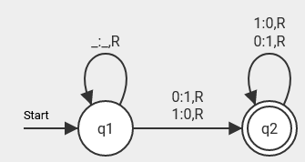

# turingmachine.clj
A simple way to simulate (deterministic) (universal) turingmachines using clojure!

# Definition: Turingmachine
A turingmachine is defined by the following septuple:

TM = $(Q, \Sigma, \Gamma, \delta, q_0, \square, F)$
where
- $Q$ = finite set of states
- $\Sigma$ = input symbols/alphabet
- $\Gamma$ = tape symbols/alphabet
- $\delta$ = a set of state transitions in the form of $(state_{now}, reads) = (state_{after}, writes, direction)$
- $q_0$ = initial state with $q_0 \in Q$
- $\square$ = the "blank" symbol
- $F$ = the set of accepted states

The Turing machine is equipped with a tape that can be extended in both directions without limit. It is also necessary to note that the machine is only permitted to advance a single step in either direction.

For the sake of simplicity, let us consider the following Turing machine:



This turingmachine only accepts words/inputs which are atleast 1 character long and start with 0 or 1 (ignores the blanks at the beginning).
All accepted states are usually circled twice. In this example we have only one accepted state, which is $q_2$.
$q_1$ on the other hand is the initial state which means:

$$ Q = \set{q_1, q_2} $$

$$ F = \set{q_2} $$

Since our input words only consist of 0, 1 and _ (blank) and we are only writing 0, 1 or _ (blank) to the tape we define...

$$ \Sigma = \set{0, 1, \\_} $$

$$ \Gamma = \set{0, 1, \\_} $$

$$ \square = \\_ $$

We may now consider the state transitions. To begin with, we shall examine $q_1$.

The notation $0:1,R$ represents a transition in which the system reads 0, writes 1, and then moves to the right on the tape. Given that the initial state is $q_1$ and the final state is $q_2$, this transition can be expressed as follows: $(q_1, 0) = (q_2, 1, R)$.
This approach can be applied to all transitions, and the resulting expressions can be summarized as follows:
- $\delta_1(q_1, \\_ ) = (q_1, \\_ , R)$
- $\delta_2(q_1, 0) = (q_2, 1, R)$
- $\delta_3(q_1, 1) = (q_2, 0, R)$
- $\delta_4(q_2, 0) = (q_2, 1, R)$
- $\delta_5(q_2, 1) = (q_2, 0, R)$

We have successfully configured a Turing machine and read a Turing machine visualization.

# Gödel number and universal turing machines
The Gödel number is a method of encoding the transition of a Turing machine as a binary number.
Universal Turing machines are capable of simulating any Turing machine, although there are a few fundamental rules that must be observed.
The initial state is always $q_1$, never $q_0$. $q_1$ is also the initial state.
The third symbol of the tape symbols is always the blank symbol.
The only accepted state is $q_2$. 

For the sake of argument, let us assume that we have the tape symbols $[0, 1, \\_]$ and the transition $(q_1, 0) = (q_2, 1, R)$. 
If we were to examine each element of this transition equation, we could encode it as follows: 
1. $q_1$ is represented by the digit 0, as $q_n$ is represented by a string of n zeros.
2. The digit 0 is the first symbol of the tape symbols, and therefore it is encoded as 0. The number of zeros is equivalent to the index of the symbol in the tape symbols.
3. $q_2$ is encoded as $00$, as previously stated.
4. $1$ is encoded as $00$ because it is the second symbol of the tape symbols.
5. $R$ (right) is encoded as $00$; $L$ (left) would be encoded as $0$.
If we combine all of these encodings and separate them with $1$, we should obtain the following result:
$=> 010100100100$

If we had more transitions we would separate them with $11$.

Should we attempt to encode this Turing machine, we would obtain the following Gödel number: $010010100100110101010100110100010001000101100010010001010110001010010010$


# Examples
## regular turing machine
> You can find some examples [here](./tuma/test/tuma/examples.clj).

The following example illustrates the process of adding one to a binary number using a Turing machine.
```clojure
(ns tuma.core
  (:require [tuma.turingmachine :as tm]
            [tuma.transition :as trans]))

(defn -main []
  ; turingmachine that adds one to a binary number and traces the transitions
  (let [t1 (trans/new-transition :q1 "1" :q1 "1" :right)
        t2 (trans/new-transition :q1 "0" :q1 "0" :right)
        t3 (trans/new-transition :q1 "_" :q3 "_" :left)
        t4 (trans/new-transition :q3 "1" :q3 "0" :left)
        t5 (trans/new-transition :q3 "0" :q2 "1" :left)
        transitions [t1 t2 t3 t4 t5]
        states [:q1 :q2 :q3]
        input-symbols ["0" "1"]
        tape-symbols ["0" "1" "_"]
        accepted-states [:q2]
        tm (tm/new-turingmachine states input-symbols tape-symbols transitions :q1 "_" accepted-states)
        input "10011"
        result (tm/emulate-tm tm input true)]
    (println result)))
```
One may either invoke the `emulate-tm` function with three parameters (turingmachine, input trace?) or with two parameters (turingmachine, input). This allows the user to specify whether or not they wish to have the transitions printed out. In the event that they do not wish to utilise this functionality, it is possible to simply omit the `trace?` parameter.

In the aforementioned example, the value of the 'trace?' parameter was set to 'true', resulting in the following output on the terminal:
```clj
source: :q1 reads: 1 destination: :q1 writes: 1 direction: :right
source: :q1 reads: 0 destination: :q1 writes: 0 direction: :right
source: :q1 reads: 0 destination: :q1 writes: 0 direction: :right
source: :q1 reads: 1 destination: :q1 writes: 1 direction: :right
source: :q1 reads: 1 destination: :q1 writes: 1 direction: :right
source: :q1 reads: _ destination: :q3 writes: _ direction: :left
source: :q3 reads: 1 destination: :q3 writes: 0 direction: :left
source: :q3 reads: 1 destination: :q3 writes: 0 direction: :left
source: :q3 reads: 0 destination: :q2 writes: 1 direction: :left
{:input 10011, :output 10100_, :end-state :q2, :verdict :accepted}
```

## universal turing machine
```clojure
(ns tuma.core
  (:require [tuma.universal-turingmachine :as utm]))

(defn -main []
  (let [goedel (str
                "01001010010011"      ; <=> :q1 "1" :q1 "1" :right
                "010101010011"        ; <=> :q1 "0" :q1 "0" :right
                "01000100010001011"   ; <=> :q1 "_" :q3 "_" :left
                "0001001000101011"    ; <=> :q3 "1" :q3 "0" :left
                "0001010010010")      ; <=> :q3 "0" :q2 "1" :left
        utm (utm/new-utm goedel ["0" "1" "_"] ["0" "1" "_"])
        input "10011"
        result (utm/emulate-utm utm input)]
    (println result)))
```
```clojure
{:input 10011, :output 10100_, :end-state :q2, :verdict :accepted}
```
The `emulate-utm` function also has the ability to use the `trace?` parameter as mentioned in the example above. 
